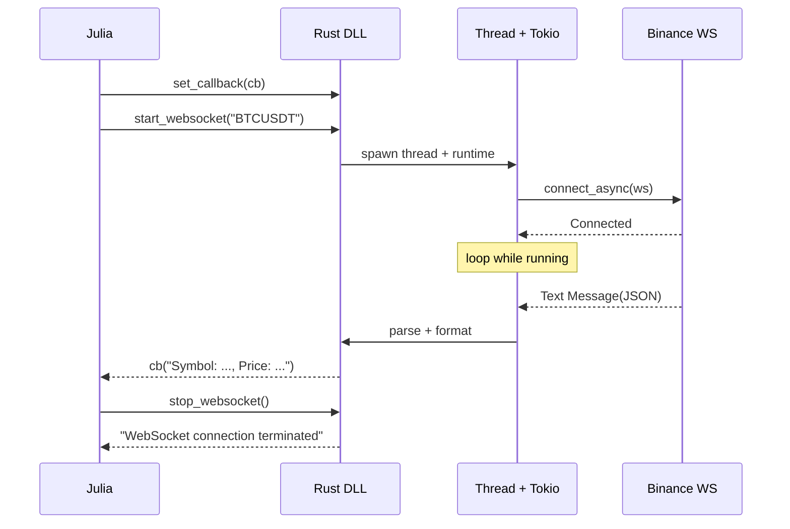

## Rust ↔ Julia Binance WebSocket 아키텍처

### 목적
- Rust `cdylib`으로 Binance 선물 WebSocket `@ticker` 스트림을 수신하고, 수신 데이터를 Julia 콜백으로 전달해 실시간 처리를 가능하게 합니다.

### 주요 구성 요소
- **Rust 동적 라이브러리 (`src/lib.rs`)**: FFI 내보내기, tokio 런타임, WebSocket 연결, JSON 파싱, Julia 콜백 호출
- **Julia 클라이언트 (`julia_src/binance_client.jl`)**: DLL 로드, 심볼 조회, 콜백 등록, 시작/중지/상태 폴링, 콘솔 출력
- **빌드 설정 (`Cargo.toml`)**: `crate-type = ["cdylib"]`, `tokio`, `tokio-tungstenite`, `serde`, `serde_json`, `url`

### 폴더 구조
```text
rust_julia_demo/
├─ Cargo.toml
├─ src/
│  └─ lib.rs
├─ julia_src/
│  ├─ binance_client.jl
│  └─ test.jl
└─ target/
   └─ release/
      └─ rust_julia_demo.dll
```

## 아키텍처 다이어그램

```mermaid
flowchart LR
  subgraph Julia Process
    J[Julia Script\n`binance_client.jl`]
  end

  subgraph Rust DLL
    R[rust_julia_demo.dll\n`src/lib.rs`]
    RT[Tokio Runtime]
    TH[Std Thread]
    WS[WebSocket (tokio-tungstenite)]
    P[serde_json Parse]
  end

  EXT[(Binance Futures\n`wss://fstream.binance.com/ws/<symbol>@ticker`)]

  J -- dlopen/dlsym --> R
  J -- set_callback(cb) --> R
  J -- start_websocket(symbol) --> R
  R -- spawn --> TH
  TH --> RT --> WS --> EXT
  EXT --> WS --> P --> R
  R -- callback(c_char*) --> J
  J -- stop_websocket() --> R
```

## 시퀀스 다이어그램



## 동작 흐름
1. Julia가 DLL을 로드하고 `set_callback`으로 콜백 포인터를 Rust에 등록합니다.
2. `start_websocket(symbol)` 호출 시, Rust는 별도 스레드에서 tokio 런타임을 띄우고 Binance WebSocket에 접속합니다.
3. 수신 텍스트 메시지를 JSON으로 파싱하여 선택 필드를 사람이 읽기 쉬운 문자열로 포맷합니다.
4. 포맷된 문자열을 C 문자열 포인터로 Julia 콜백에 전달합니다.
5. Julia는 콜백에서 `unsafe_string`으로 변환해 출력/처리합니다.
6. `stop_websocket()` 호출 시 루프가 종료되고 리소스를 정리합니다.

## 데이터 포맷
- 입력 스트림: Binance Futures `@ticker` JSON
- Rust 내부 매핑 필드(예): `event_time(E)`, `symbol(s)`, `close_price(c)`, `volume(v)`
- Julia로 전달: 예) `"Symbol: BTCUSDT, Price: 65000.1, Volume: 1234.5, Time: 1730000000"`

## 빌드 및 실행
### Rust 빌드 (Release)
```bash
cargo build --release
```

### Julia 실행
```julia
include("julia_src/binance_client.jl")
# 스크립트를 직접 실행하거나, main()을 호출하여 시작할 수 있습니다.
```

## 안전성과 권장 개선사항
- FFI 문자열 전달
  - 현재: Julia에서 `pointer(symbol)`로 `Ptr{UInt8}` 전달은 GC/널 종료 위험
  - 권장: `ccall(..., (Cstring,), symbol)`로 타입을 `Cstring`으로 선언
- 전역 상태의 스레드 안전성
  - 현재: `static mut`로 콜백/플래그 관리 → 데이터 레이스 위험
  - 권장: `AtomicBool`로 실행 플래그, `OnceLock<JuliaCallback>` 또는 동기화 래퍼로 콜백 저장
- 즉시 정지 처리
  - 권장: `tokio::select!`로 종료 신호 채널 감시 또는 타임아웃을 두어 주기적으로 종료 확인
- 데이터 전달 정책
  - 필요 시 원본 JSON 그대로 전달 옵션을 추가하여 Julia에서 유연하게 파싱/집계 가능

## 로그와 오류 처리
- 연결/성공/오류/종료 이벤트는 모두 콜백 또는 콘솔 로그로 노출됩니다.
- JSON 파싱 실패 시 에러 문자열을 콜백으로 전달하여 상위 레벨에서 대응할 수 있습니다.

## 한눈에 요약
- Rust DLL이 WebSocket 수신·파싱·콜백 호출을 담당하고, Julia는 DLL 로드·콜백 등록·수명주기 제어를 담당합니다.
- 안정성을 위해 FFI 문자열 타입과 전역 상태 동기화를 개선하면, 장시간 운용과 종료 응답성이 좋아집니다.


